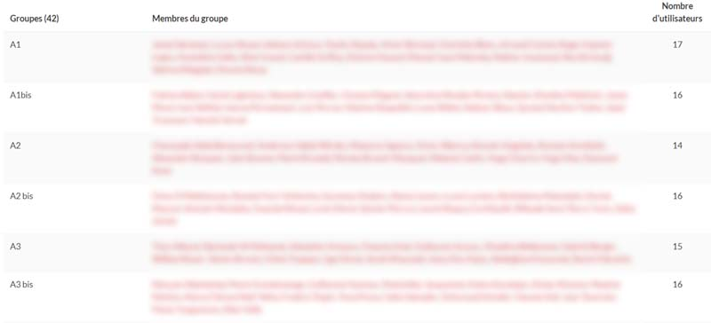

# MoodleGroupToCsv
A local web page with some JavaScript to convert a list of Moodle groups with students to a searchable list for spreadsheet application.

# How to use it
## Step 1: get the list of groups with users from Moodle

Got to the settings of groups in your course. In the global overview of groups, you should see a list of groups, their users and the number of users within each group (sorry, the image was done on a French Moodle):

You copy paste text into the dedicated area of the MooodleGroupToCsv.html local page. Here for instance, from A1 (left top) to 16 (bottom right on last line).

## Step 2: set (or not) the file name to download

## Step 3: click on the "CreateCSV!" button to get your CSV file

## Step 4: import the CSV file to your favorite spreadsheet application

It is usually as easy as open the ".csv" file. You can use this list using vertical search function to associate users to their group.